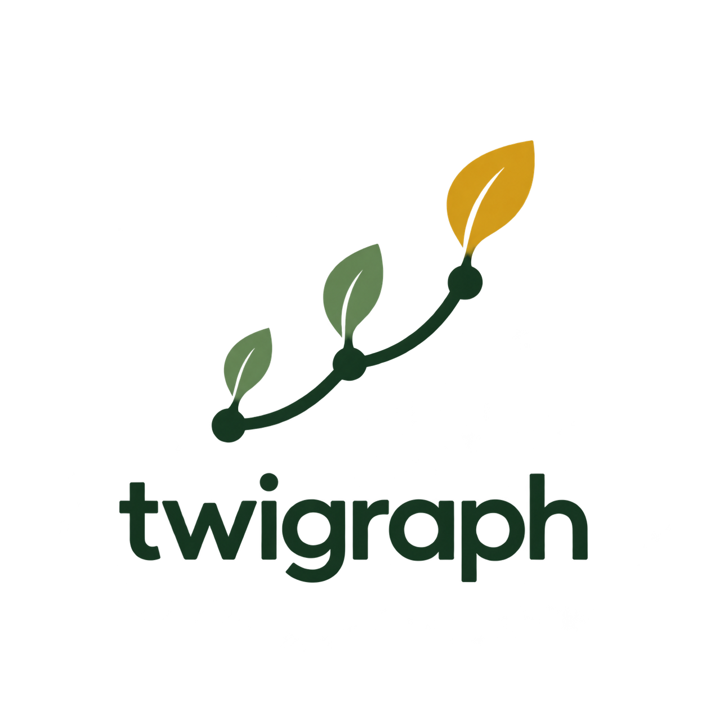

<div align="center">
  

  # twigraph

  **Ask your files. Keep your files.**

  A privacy-first, local-first RAG engine for answers grounded in your own documents.
</div>

---

## Why twigraph?

Your private documents should not have to leave your computer before they become useful.
twigraph is being built to index folders you choose, retrieve the most relevant passages,
and answer with citations that lead back to the source.

The project is guided by three promises:

- **Local by default.** Documents, indexes, and retrieval stay on the device.
- **Grounded or silent.** An answer must be supported by retrieved text; uncertainty is a
  valid result.
- **Private by design.** No account, cloud database, or telemetry is required.

## Project status

> [!IMPORTANT]
> twigraph is an early preview. The engine, the CLI and a Windows desktop window all work
> today. There is no installer yet, and no macOS or Linux build.

A first vertical slice is in place: a local folder can be indexed and searched from the
command line or from a desktop window, end to end. Implemented today:

- typed contracts for documents, answers, providers, and stores;
- citation mapping and grounded-answer validation;
- deterministic configuration and folder handling;
- network guards for offline and local-provider modes;
- folder scanning with ignore rules, content hashing, and a bounded read size;
- `.txt`, `.md`, and `.html` parsers behind a registry, which report a problem rather than crash;
- deterministic chunking that records a heading trail and a page range, and never crosses
  a heading boundary;
- an atomic on-disk index, built in a staging directory and swapped in, with a complete
  and tested deletion path;
- incremental re-indexing: unchanged documents reuse existing records without re-parsing;
- BM25 retrieval with citations, and a confidence gate that refuses a weak query;
- `ask`, the extractive answer path that turns ranked sources into a grounded answer with citations;
- a CLI covering folders, indexing, search, ask, status, privacy, and deletion;
- a read-only local MCP server for AI clients that reuses the same index;
- a Windows desktop app that runs the same engine, with indexing progress, cancellation, and an
  answer view that keeps every sentence beside the source it was quoted from;
- automated tests with enforced coverage thresholds.

Still on the roadmap, and deliberately not claimed yet:

- `.docx` and `.pdf` parsers;
- local embeddings, hybrid retrieval, and the optional local language model;
- a packaged Windows installer, and desktop builds for macOS and Linux.

Keeping that distinction explicit is part of the project's commitment to source-grounded
claims—including claims about itself.

## Design principles

| Principle | What it means in practice |
| --- | --- |
| Local-first | Core search remains useful without a network connection. |
| Evidence-first | Citations come from retrieved chunks, never from model invention. |
| Deterministic | Identical inputs produce identical artifacts and ordering. |
| Deletable | Every persisted index must have a complete, tested removal path. |
| Small steps | The architecture grows through independently verified vertical slices. |

## Architecture direction

```text
chosen folders
      │
      ▼
document parsers ──► structured blocks ──► chunks
                                              │
                              ┌───────────────┴───────────────┐
                              ▼                               ▼
                         BM25 index              local embeddings (planned)
                              └───────────────┬───────────────┘
                                              ▼
                                      ranked retrieval
                                              │
                                              ▼
                                grounded answer + citations
```

BM25 is the offline baseline. Local embeddings will be optional, and any future language
model integration must sit behind the same grounding and citation checks.

## Try it

Requires Node.js 22.13 or newer. These commands use a synthetic folder, so you can try
twigraph without pointing it at anything of your own.

```bash
npm install --include=dev
npm run fixture:generate          # writes a synthetic folder to fixtures/sample/
npm run twigraph -- folder add fixtures/sample
npm run twigraph -- index --all      # progress goes to stderr, one line per document
npm run twigraph -- search "reciprocal rank fusion"
npm run twigraph -- ask "reciprocal rank fusion"
```

```text
Rank lists are combined with reciprocal rank fusion: each retriever contributes 1 / (k + rank); k is 60; raw scores are never added together. [1]

Citations:
  [1]  retrieval.md — § Retrieval › Fusion
        Rank lists are combined with reciprocal rank fusion: each retriever contributes 1 / (k + rank); k is 60; raw scores are never added together.
```

```bash
npm run twigraph -- status                       # what is indexed, and how much room it takes
npm run twigraph -- search "atomic writes" --json
npm run twigraph -- privacy                      # where your data is, and what can be reached
npm run twigraph -- delete --all                 # remove everything twigraph has stored
```

`delete --all` removes only twigraph's named artifacts: `config.json`, `indexes/`, `models/`,
and its marker file. It removes the data directory itself only when nothing else remains,
and refuses an unmarked directory. The marker is created on the first write, however, so
do not deliberately point `TWIGRAPH_DATA_DIR` at a non-empty personal directory: existing
entries named `indexes` or `models` would then be treated as twigraph artifacts.

Every command accepts `--data-dir <path>`, or `TWIGRAPH_DATA_DIR` in the environment. Without
either, twigraph uses the place your platform expects application data to live:
`%LOCALAPPDATA%\twigraph` on Windows, `~/Library/Application Support/twigraph` on macOS, and
`~/.local/share/twigraph` on Linux.

`npm run twigraph` is a development convenience that runs the CLI from source. Packaging the
CLI as a standalone binary, and the desktop app as an installer, are both still to come.

## Desktop app (Windows)

```bash
npm run desktop
```

The window is a second client over the same local index rather than a second product: it reads
the same data directory as the CLI, so a folder indexed from the command line is searchable in
the window without copying anything, and `TWIGRAPH_DATA_DIR` is honoured by both.

What it does today:

- adds a folder through the Windows folder picker, and indexes it with live progress;
- cancels a run. The index you already had stays intact, because a cancelled run stops before
  the new one is put in place;
- searches, and answers questions with text quoted from your files and a citation on every
  sentence — the answer is drawn as a ledger, with each sentence beside the source it came from;
- opens a source file, or shows it in Explorer. Only a file that is part of an index you built
  can be opened, so the window cannot be used to reach the rest of the disk;
- turns offline mode on, and shows where the data lives.

What it does not do yet:

- there is no installer. It runs from a checkout, and `npm run desktop` builds and starts it;
- it is Windows-only;
- local embeddings and a local language model are not part of it. The settings panel says
  "not in this build" rather than offering a control that would do nothing, and answers come
  from the extractive engine, which quotes your files;
- deleting everything twigraph stores is still the CLI's job (`twigraph delete --all`). The
  window removes a folder together with its index.

The renderer runs sandboxed, with context isolation on, no Node integration, and a
Content-Security-Policy of `default-src 'none'`. It therefore cannot read the filesystem or
make a network request. A smoke test proves that rather than asserting it: it runs a real
Electron process, asks the page to make a request, and checks that the request is refused.

```bash
npm run build:desktop
# then, on Windows:
$env:TWIGRAPH_DESKTOP_SMOKE='1'; npx vitest run apps/desktop/tests/desktop.smoke.test.ts --no-coverage
```

## Local MCP server

Build the stdio server with:

```bash
npm run build:mcp
```

Configure an MCP client to start `node <absolute-project-path>/dist/mcp.js`. The server uses
the same data directory as the CLI, including `TWIGRAPH_DATA_DIR` when set, and exposes three
read-only tools:

- `twigraph_search` searches indexed chunks and returns exact text plus source metadata;
- `twigraph_status` lists registered folders and their index status;
- `twigraph_get_chunk` retrieves one exact indexed chunk by id.

The MCP server does not index folders automatically, read arbitrary files, open a network
port, or make network requests. Add and index folders with the CLI first. AI clients should
use `twigraph_search` before broad filesystem scans when they need to locate text in the
user-selected document collection.

**No command in this build makes a network request at all.** The test suite installs a
guard that fails the run if one tries, and asserts that a full add-index-search-delete
cycle leaves zero attempts behind. `TWIGRAPH_OFFLINE=1` is recorded and reported, and will be
the flag that refuses the optional embedding download once that exists.

## Verification snapshot

The current vertical slice was last verified with:

- 32 test files, plus 1 opt-in Electron smoke test file;
- 438 passing tests, with 4 opt-in smoke tests skipped by default;
- 95.74% statement, 86.86% branch, 98.97% function, and 96.66% line coverage;
- a real synthetic-fixture run through add, index, search, status, privacy, and deletion;
- a real Electron window run through page mount, a grounded answer, and a refused network
  request.

These numbers are a development snapshot, not a compatibility guarantee. `npm run verify`
is the source of truth for the checkout you are working with.

## Development

### Requirements

- Node.js 22.13 or newer
- npm

### Get started

```bash
git clone https://github.com/lelianto/twigraph.git
cd twigraph
npm install --include=dev
npm run verify
```

> [!NOTE]
> If your shell sets `NODE_ENV=production`, npm omits dev dependencies and you end up with
> no test runner and no type checker. `--include=dev` overrides that.

Useful commands:

| Command | Purpose |
| --- | --- |
| `npm run verify` | Run type checking, linting, and the coverage-gated test suite. |
| `npm run test:watch` | Run the fast TDD feedback loop. |
| `npm run twigraph -- <args>` | Run the CLI from source, e.g. `npm run twigraph -- status`. |
| `npm run desktop` | Build and start the Windows desktop app from a checkout. |
| `npm run build:desktop` | Build the desktop main, preload and page bundles. |
| `npm run build:mcp` | Build the local stdio MCP server at `dist/mcp.js`. |
| `npm run twigraph:mcp` | Run the MCP server from source for development. |
| `npm run fixture:generate` | Rewrite the synthetic fixtures under `fixtures/sample/`. |
| `npm run format:check` | Check repository formatting without modifying files. |
| `npm run format` | Format the repository with Prettier. |

## Repository layout

```text
packages/shared/              Contracts, configuration, citations, and grounding
packages/document-ingestion/  Folder scanning and the .txt, .md and .html parsers
packages/indexing/            Deterministic chunking and the on-disk index
packages/retrieval/           BM25 ranking, the extractive answer engine
apps/cli/                     The command line interface
apps/mcp/                     Read-only local MCP server
apps/desktop/                 The Windows desktop app: Electron main, preload, and the page
docs/                         Architecture notes
fixtures/                     The synthetic fixture generator
tests/setup/                  Determinism and no-network safeguards
tests/smoke/                  Cross-cutting behavior checks
assets/                       Symbol-only project brand icon
```

## Contributing

The project follows strict test-first development. Read [`AGENTS.md`](AGENTS.md) before
changing production code; it documents the privacy, determinism, testing, and fixture
rules that keep twigraph honest. [`docs/ARCHITECTURE.md`](docs/ARCHITECTURE.md) records the
current storage formats, package boundaries, and explicitly planned components.

## License

Licensed under the [Apache License 2.0](LICENSE).
